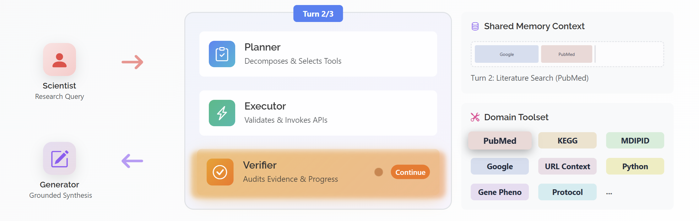
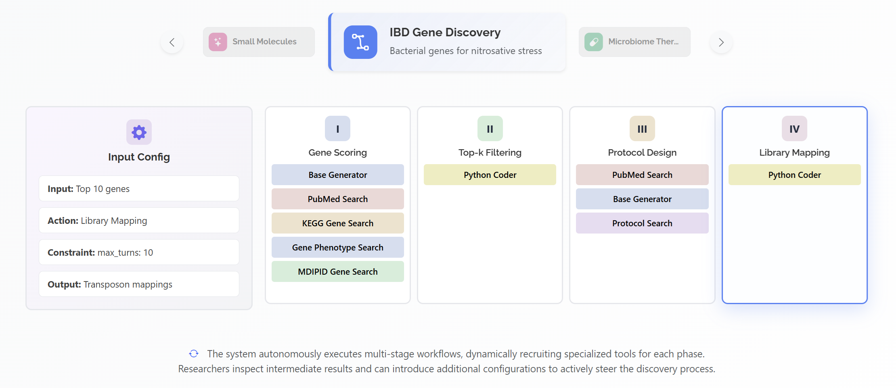
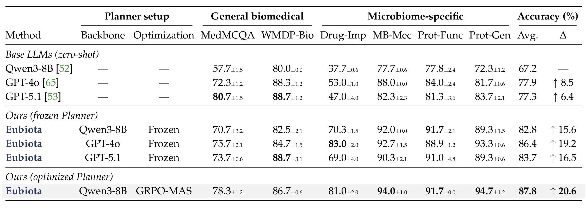
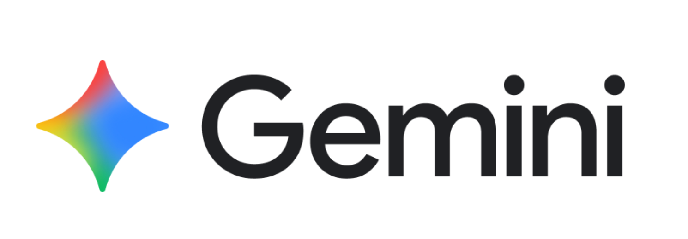
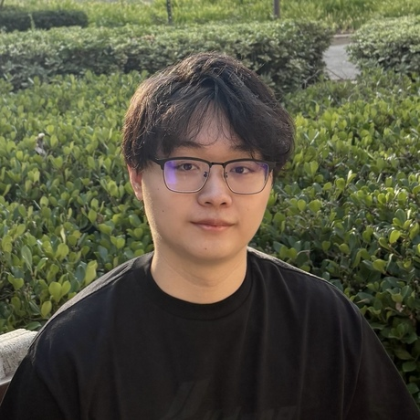

<p align="center">
  
</p>

<h1 align="center">
Eubiota: Agentic AI for Autonomous Microbiome Discovery
</h1>

<p align="center">
A modular framework for mechanistic reasoning and experimental design. Eubiota orchestrates specialized agents to drive tool-grounded discovery through outcome-driven refinement.
</p>

<div align="center">

[](https://github.com/lupantech/Eubiota/blob/main/LICENSE)
[](https://www.biorxiv.org/content/10.64898/2026.02.27.708412v1)
[](https://eubiota.ai/)
[](https://app.eubiota.ai/)

</div>


<p align="center">
  <a href="https://www.stanford.edu/"></a>&nbsp;&nbsp;&nbsp;&nbsp;
  <a href="https://engineering.stanford.edu/"></a>&nbsp;&nbsp;&nbsp;&nbsp;
  <a href="https://med.stanford.edu/"></a>&nbsp;&nbsp;&nbsp;&nbsp;
  <a href="https://hai.stanford.edu/"></a>
</p>


## Overview

Eubiota is a modular agentic platform for end-to-end discovery in the human microbiome, combining multi-agent reasoning with domain-specific tools.

## System Architecture
Specialized agents orchestrate an iterative cycle of planning, execution, and verification via shared memory to ensure rigorous evidence grounding.

[](https://eubiota.ai/#framework)


## News & Updates

- **[2026.02]** Coming.


## Setup

### Prerequisites

- **Python 3.11** (recommended)

### Installation

**Quick Install with UV (Recommended)**

```bash
bash setup.sh
source .venv/bin/activate
```

This installs with inference dependencies: `uv pip install -e ".[infer]"`

**Installation Options**

| Use case | Command |
|----------|---------|
| Inference only (recommended) | `bash setup.sh infer` |
| Training | `bash setup.sh infer train` |
| Extended engines (Dashscope, Together, Ollama) | `uv pip install -e ".[extended-engines]"` |
| Full (all features + training) | `uv pip install -e ".[all]"` and `bash setup_stable_gpu.sh` |


### Download Tool Databases
```bash
cd data
source create_all_dbs.sh
```


### Configure API Keys

Copy the `.env.template` file from `scientist/.env.template` and rename it to `.env`, then place it in the `scientist/` folder. Update the following variables with your own API keys:
- `OPENAI_API_KEY` (for judging reasponse)
- `GOOGLE_API_KEY` (for Google Search tool)
- `PERPLEXITY_API_KEY` (for Perplexity Search tool)

Please check [API Key Setup Guide](assets/docs/api_key.md) for detailed instructions on how to obtain these keys.


## Quick Start

Run a single query:

```bash
python scientist/solver_scientist.py
```


## Check Before You Run (Recommended)
Before running inference or training, we recommend verifying that your API keys and environment are properly configured.

### Test Tools
Run the following command to test all integrated tools:
```bash
cd scientist
python -m tools.test_tools
```
Example output:
```text
Success Rate: 100.0%
Tools requiring LLM: 8
  - pubmed_search
  - ...
Tools not requiring LLM: 6
  - kegg_gene_search
  - ...
```

### Test LLM Engines
Verify that your LLM engines (OpenAI, DashScope, Gemini, etc.) are correctly initialized and responding:
```bash
python scientist/scripts/test_llm_engine.py
```
example output: 
```
🚀 Starting fault-tolerant test for 11 engines...
✅ Success: 6
 • gpt-4o
 • azure-gpt-4
 • dashscope-qwen2.5-3b-instruct
 • gemini-1.5-pro
 • vllm-meta-llama/Llama-3-8b-instruct
 • together-meta-llama/Llama-3-70b-chat-hf
...
🎉 Testing complete. Script did NOT crash despite errors.
```

## Scientific Benchmark 
Serve the trained planner model with VLLM (here we deploy our [Eubiota-8b planner model](https://huggingface.co/Eubiota/eubiota-planner-8b)):
```bash
bash setup.sh train
bash tests/exp/serve_vllm.sh
```
for more vllm serving local model details, please see [guidance](assets/docs/serve_vllm_local.md)

Run inference on specific benchmark tasks:
```bash
cd test
# Run Our Drug-Microbiome_Impact benchmark
bash tests/Drug-Microbiome_Impact/run.sh
```

After running, each task folder (e.g., `test/Drug-Microbiome_Impact/`) will contain:
- `data/`: Contains the evaluation dataset (e.g., `data.json`).
- `logs/`: Contains detailed execution logs for each problem index (organized by model label).
- `results/`: Contains the model's generated answers (`output_i.json`) and final evaluation scores (`finalscore_*.log`).

You can find more benchmarking details in [benchmark.md](assets/docs/benchmark.md). 

## Training

### Dataset Preparation
We mix four domains datasets for training: [NQ (Natural Questions)](https://huggingface.co/datasets/RUC-NLPIR/FlashRAG_datasets) for agentic search, [DeepMath-103K](https://huggingface.co/datasets/zwhe99/DeepMath-103K) for mathematical reasoning, [PubMedQA](https://huggingface.co/datasets/qiaojin/PubMedQA) & [MedQA-USMLE](https://huggingface.co/datasets/GBaker/MedQA-USMLE-4-options) for general medical-biology reasoning, and our curated microbiome reasoning dataset [HERE](https://huggingface.co/datasets/Eubiota/microbio-bench). (Please remember to access before you run `make_train_data.py`)

```bash
# train & validation data with specified ratio
python data/make_train_data.py
```

for more useage of how to customize training & validation data, see [data/data_prepare.md](assets/docs/data_prepare.md)

After that, data dir should be:
```
data/
├── train/
│   └── train.parquet
├── val/
│   └── val.parquet (100 samples)
└── make_train_data.py
```

### Start Training
Training uses **Group Relative Policy Optimization for Multi-Agent Systems (GRPO-MAS)** for the planner module.

Start training with tmux:
```bash
# Login to wandb first
wandb login

# Create tmux session and start agentflow service (Window 0, make sure you are at the project root and ran `source .venv/bin/activate` in each window)
tmux new-session -s eubiota
bash trainer/train_scientist/serve_with_logs.sh

# Create new window (Ctrl+B then C), modify the `BASE_DATA_DIR` in `trainer/train_scientist/config.yaml` to the absolute path of the data directory, and then start training (Window 1)
bash trainer/train_scientist/train_with_logs.sh
```

**Configuration:**
All training hyperparameters are in [`trainer/train_scientist/config.yaml`](trainer/train_scientist/config.yaml) (model settings, tools, RL parameters, resources, etc.)
For more details, please see [Configuration Guide](assets/docs/train_config.md).

**Logging:**
We provide a comprehensive logging to monitor training. See [logs.md](assets/docs/logs.md) for more details.

## Customization

For detailed instructions on adding new tools and configuring the agent modules, please refer to the [Customization Guide](assets/docs/customization.md).

An example of our scientific experiment verified workflow visualization is as follows:

[](https://eubiota.ai/#framework)

[Experience designing your own workflow online](https://app.eubiota.ai/workflow)


### ➕ Adding New Tools

<table>
<tr>
<td>

**Step 1:** Create Tool Directory
```bash
scientist/tools/your_tool_name/
├── tool.py
├── config.yaml
└── README.md
```

</td>
<td>

**Step 2:** Implement Tool Card
```python
class YourTool(BaseTool):
    def execute(self, query):
        # Your tool logic
        return result
```

</td>
</tr>
<tr>
<td>

**Step 3:** Register in `scientist/tools/__init__.py`
```python
from .your_tool_name import YourTool
# Add to __all__ and TOOL_REGISTRY
__all__.append("YourTool")
TOOL_REGISTRY["Your_Tool"] = YourTool
```

</td>
<td>

**Step 4:** Register Tool
Add to configuration:
```yaml
enabled_tools:
  - Your_Tool_Name
```

</td>
</tr>
</table>


## Scientific Experiments

<details>
<summary>Main Scientific Results</summary>



</details>

<details>
<summary>Eubiota driven inflammatory stress gene discovery</summary>

[Task1-Part1](assets/docs/tasks/main_task_1_genetic_1.pdf)
[Task1-Part2](assets/docs/tasks/main_task_1_genetic_2.pdf)

</details>

<details>
<summary>Eubiota assisted therapeutic design for gut diseases</summary>

[Task2](assets/docs/tasks/main_task_2_therapy.pdf)

</details>

<details>
<summary>Eubiota enabled pathogen-biased antibiotic cocktail design</summary>

[Task3](assets/docs/tasks/main_task_3_drug.pdf)

</details>

<details>
<summary>Eubiota guided anti-inflammatory molecule discovery</summary>

[Task4](assets/docs/tasks/main_task_4_molecule.pdf)

</details>


## Acknowledgements

<p align="center">
  <a href="https://chanzuckerberg.com/"></a>&nbsp;&nbsp;&nbsp;&nbsp; <a href="https://hai.stanford.edu/"></a>&nbsp;&nbsp;&nbsp;&nbsp; <a href="https://www.renaissancephilanthropy.org/"></a>&nbsp;&nbsp;&nbsp;&nbsp; <a href="https://deepmind.google/technologies/gemini/"></a>
</p>

We also thank the following open-source projects:
- [VeRL](https://github.com/volcengine/verl) for the excellent RL framework design.
- [vLLM ](https://github.com/vllm-project/vllm) for fast LLM inference support.
- [AgentFlow](https://github.com/lupantech/AgentFlow) and [Agent Lightning](https://github.com/microsoft/agent-lightning) for early-stage exploration in multi-agent RL training.


## Eubiota Team

We are grateful for all the help we got from our contributors!

<table>
	<tbody>
		<tr>
            <td align="center">
                <a href="https://lupantech.github.io/">
                    
                    <br />
                    <sub><b>Pan Lu</b></sub>
                </a>
            </td>
            <td align="center">
                <a href="https://yifangao96.github.io/">
                    
                    <br />
                    <sub><b>Yifan Gao</b></sub>
                </a>
            </td>
            <td align="center">
                <a href="https://www.linkedin.com/in/williamgpeng">
                    
                    <br />
                    <sub><b>William G. Peng</b></sub>
                </a>
            </td>
            <td align="center">
                <a href="https://isaacghx.github.io/about/">
                    
                    <br />
                    <sub><b>Haoxiang Zhang</b></sub>
                </a>
            </td>
            <td align="center">
                <a href="https://kunlun-zhu.github.io/">
                    
                    <br />
                    <sub><b>Kunlun Zhu</b></sub>
                </a>
            </td>
        </tr>
        <tr>
            <td align="center">
                <a href="https://profiles.stanford.edu/elektra-krobinson">
                    
                    <br />
                    <sub><b>Elektra Robinson</b></sub>
                </a>
            </td>
            <td align="center">
                <a href="https://scholar.google.com/citations?user=AvbV0HcAAAAJ&hl=en">
                    
                    <br />
                    <sub><b>Qixin Xu</b></sub>
                </a>
            </td>
            <td align="center">
                <a href="https://sonnenburglab.stanford.edu/people/kent-kotaka">
                    
                    <br />
                    <sub><b>Masakazu Kotaka</b></sub>
                </a>
            </td>
            <td align="center">
                <a href="https://profiles.stanford.edu/harrison-zhang">
                    
                    <br />
                    <sub><b>Harrison G. Zhang</b></sub>
                </a>
            </td>
            <td align="center">
                <a href="https://bingxuanli.com/">
                    
                    <br />
                    <sub><b>Bingxuan Li</b></sub>
                </a>
            </td>
        </tr>
        <tr>
            <td align="center">
                <a href="https://profiles.stanford.edu/anthony-shiver?releaseVersion=11.5.3">
                    
                    <br />
                    <sub><b>Anthony Shiver</b></sub>
                </a>
            </td>
            <td align="center">
                <a href="https://yejinc.github.io/">
                    
                    <br />
                    <sub><b>Yejin Choi</b></sub>
                </a>
            </td>
            <td align="center">
                <a href="https://whatislife.stanford.edu/">
                    
                    <br />
                    <sub><b>Kerwyn Casey Huang</b></sub>
                </a>
            </td>
            <td align="center">
                <a href="https://sonnenburglab.stanford.edu/">
                    
                    <br />
                    <sub><b>Justin L. Sonnenburg</b></sub>
                </a>
            </td>
            <td align="center">
                <a href="https://www.james-zou.com/">
                    
                    <br />
                    <sub><b>James Zou</b></sub>
                </a>
            </td>
		</tr>
	<tbody>
</table>


## Citation

```bibtex
@article{eubiota2026lu,
    title={Modular Agentic AI for Autonomous Discovery in the Gut Microbiome},
    author={},
    journal={arXiv preprint arXiv:TBD},
    year={2026}
}
```